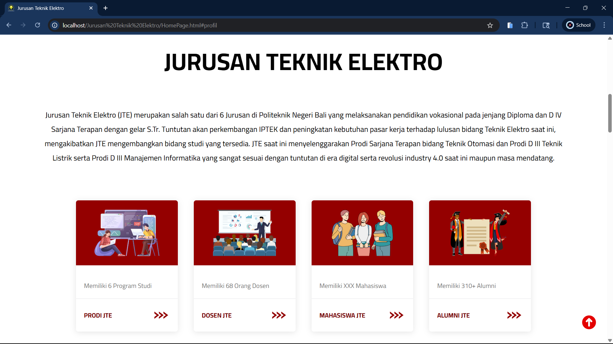
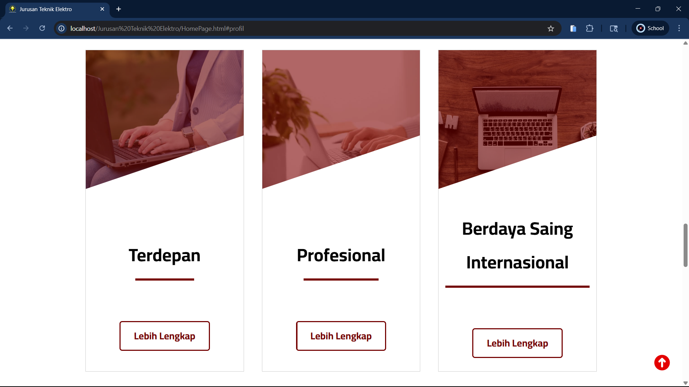
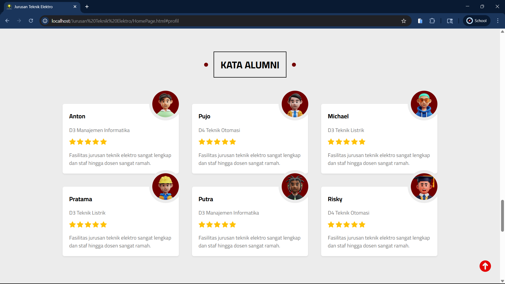
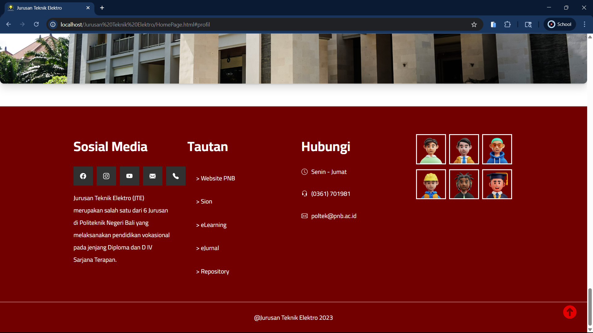
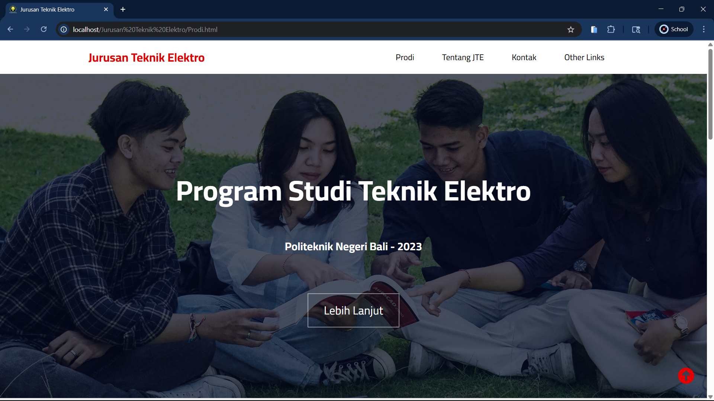
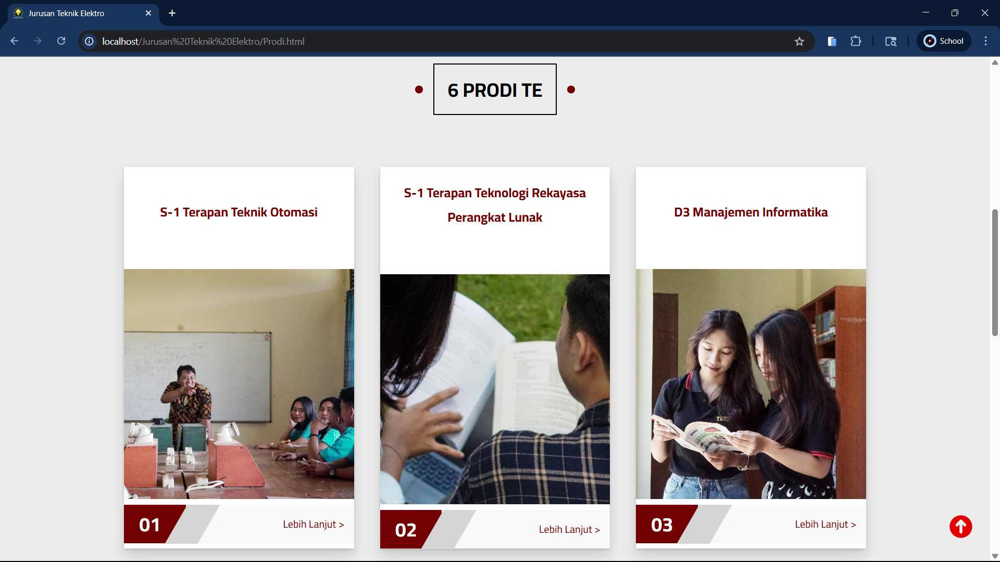
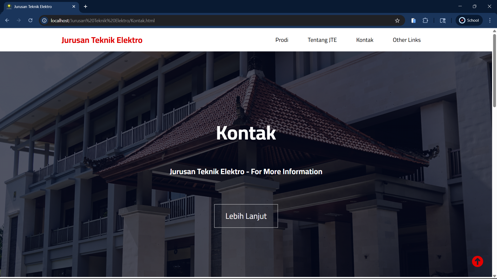
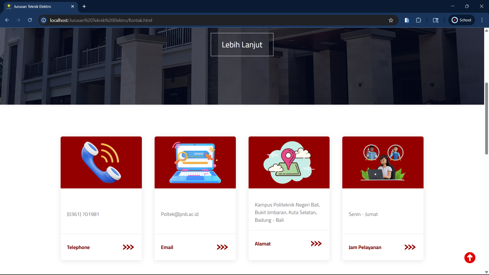
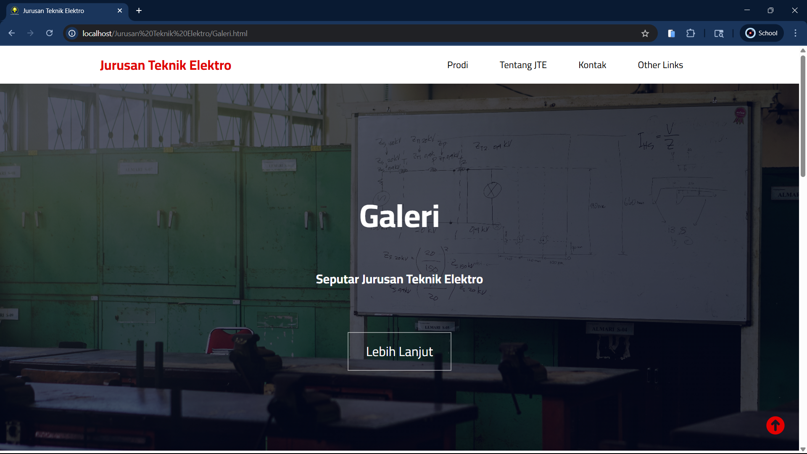
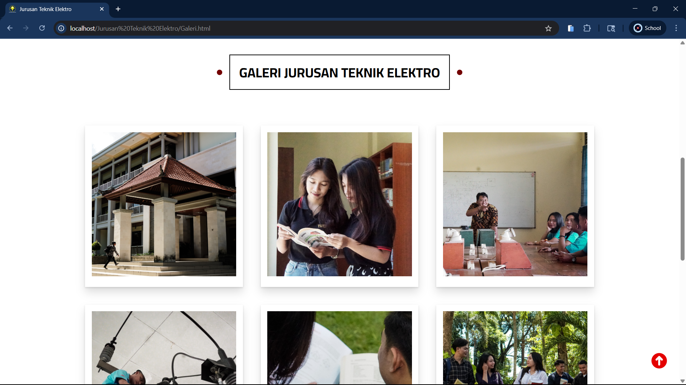

# ⚡ Jurusan Teknik Elektro Website

Website sederhana untuk Jurusan Teknik Elektro Politeknik Negeri Bali.  
Berisi mengenai informasi program studi, kontak, galeri, dan profil jurusan dalam satu website!

> Dibuat saat semester 2 sebagai proyek pembelajaran desain web html + css.

## 📁 Struktur Folder

- `HomePage.html` — Halaman utama
- `Prodi.html` — Informasi program studi
- `TentangJTE.html` — Tentang jurusan
- `Kontak.html` — Kontak jurusan
- `Galeri.html` — Galeri foto
- `css/` — Folder stylesheet
- `imgs/` — Folder gambar

## ✨ Fitur Utama

- Navigasi mudah antar halaman
- Galeri foto kegiatan jurusan
- Informasi kontak & profil jurusan
- Desain sederhana dan menarik

## 🖼️ Tampilan User Interface

### 🏠 Home

<table>
  <tr>
    <td></td>
    <td></td>
  </tr>
  <tr>
    <td></td>
    <td></td>
  </tr>
  <tr>
    <td></td>
    <td></td>
  </tr>
</table>

### 📚 Program Studi

<table>
  <tr>
    <td></td>
    <td></td>
  </tr>
</table>

### 📞 Kontak

<table>
  <tr>
    <td></td>
    <td></td>
  </tr>
</table>

### 🖼️ Galeri

<table>
  <tr>
    <td></td>
    <td></td>
  </tr>
</table>
